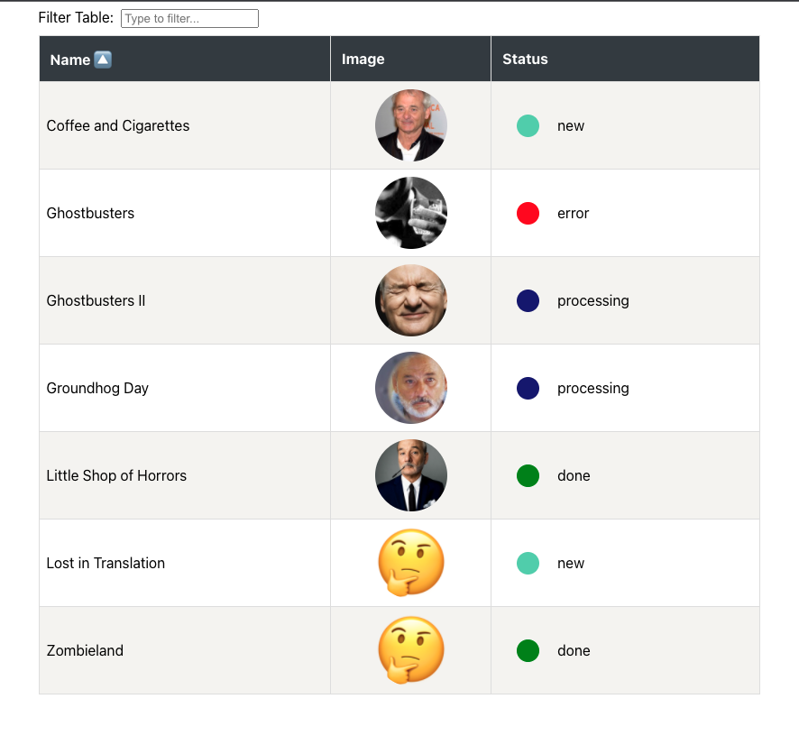

# React Table

This small repo contains the code I wrote for a coding challenge.
Be amazed by the overwhelming experience of viewing data in a table!

## The features

- Show table with all items
- Table is filterable by name
    - Trigger filter with some delay (200ms)

- Center image in a rounded box
    - If there is no image show a placeholder instead

- Open modal with full view of image by clicking on it
    - Close modal on press Esc button
    - Close modal on background click

- Status should be shown in different colors

- Sort items by name (ASC/DESC) by clicking on column
- Show spinner on loading data
- Handle API errors

## Tech stack

- TypeScript
- React
    - Function components and hooks
    - React Context API
- StyledComponents for CSS

There was a backend provided, but I use my github pages as a json API.